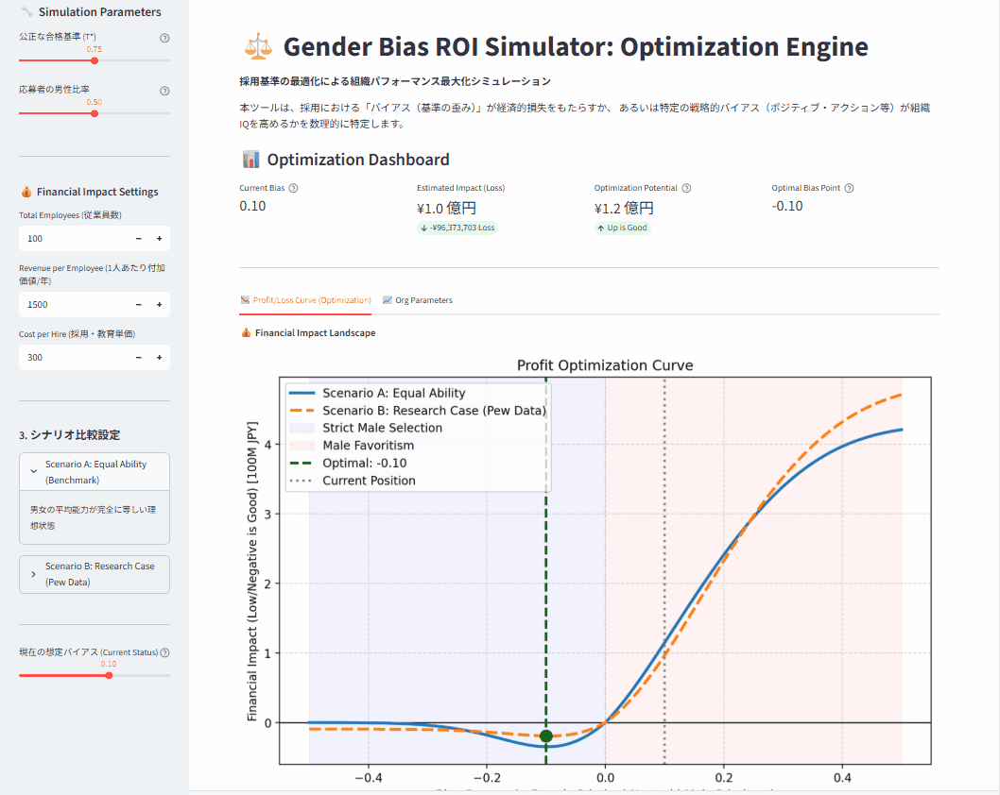

# 📊 Gender Bias ROI & Optimization Engine
**人的資本におけるバイアスがもたらす「経済的損失」と「組織IQの低下」を定量化する数理モデル**

[](https://gender-bias-simulation-efntmryjj8pth6vr86vpwn.streamlit.app/)


<br>



## 📌 Executive Summary
**「能力はあるのに選ばれない人材」の排除は、B/S（貸借対照表）には載らない巨額の負債である。**

本プロジェクトは、採用・選抜プロセスにおける**「構造的バイアス（Structural Bias）」**が、組織の平均能力（Organizational IQ）を低下させ、結果として**どれだけの経済的損失（Opportunity Loss）**を生むかを可視化する**意思決定支援システム（DSS）**のプロトタイプです。

単なる「ダイバーシティの啓蒙」ではなく、以下の問いに対する**「数理的な解」**を提示します。

> 👉 **「現状のバイアス（男性優遇/現状維持）は、年間いくらの逸失利益を生んでいるか？」**
> 👉 **「組織パフォーマンスを最大化する『採用基準の黄金比（最適解）』はどこか？」**

---

## 🎯 Business Use Cases
本モデルは、感覚論で語られがちな「多様性」を、ROI（投資対効果）の文脈で再定義します。

1.  **人事・採用戦略（HR Strategy）**
    * 「男性枠」維持のために基準を下げることによる、人材プールの質的劣化（Talent Density Dilution）を定量評価。
2.  **人的資本ROIの算出**
    * バイアスに起因する「機会損失」と「採用浪費（Sunk Cost）」を円換算で可視化し、経営会議レベルの議題へ昇華。
3.  **ガバナンス・リスク管理**
    * 「統計的に不合理な採用」が中長期的な競争力に与えるダウンサイドリスクのシミュレーション。

---

## 🧠 Modeling Architecture (Mathematical Logic)
本エンジンは、感情やイデオロギーを排除し、厳密な統計確率モデルに基づいて構築されています。

### 1. Truncated Normal Distribution Model (切断正規分布)
人材の能力分布を正規分布 $N(\mu, \sigma^2)$ と仮定し、バイアス（$\gamma$）による閾値変動が、合格者集団の期待値 $E[X|X>T]$ をどう歪めるかを計算します。
* **Selection Distortion:** バイアス強度に応じた「平均能力の低下率」を算出。
* **Pipeline Bayesian Inference:** 市場の供給比率（パイプライン）と採用基準から、事後的な組織構成比を推計。

### 2. Financial Impact Conversion (財務換算レイヤー)
算出された「組織IQ（平均能力）」の変動を、以下の式を用いて財務インパクトに変換します。
$$Loss = (1 - \frac{Ability_{current}}{Ability_{base}}) \times RevenuePerEmployee \times N$$

---

## 📊 Outputs (Dashboard)

シミュレーターは以下のインサイトを即座に出力します。

| Output Metrics | Description |
| :--- | :--- |
| **📉 Financial Loss Curve** | バイアス強度に応じた**「推定年間損失額（億円）」**の推移グラフ。 |
| **🏆 Optimization Point** | 組織の利益が数学的に最大化される**「最適バイアス値（理論解）」**の特定。 |
| **🧠 Org Capability** | バイアスによって毀損された組織の平均能力スコア（IQ）。 |
| **👥 Pipeline Reality** | 「実力主義」を徹底した場合に、本来あるべき男女構成比のシミュレーション。 |

---

## 💻 How to Run

本ツールは Streamlit アプリケーションとして構築されています。

```bash
# 1. Clone repository
git clone [https://github.com/keisuke-data-lab/gender-bias-simulation.git](https://github.com/keisuke-data-lab/gender-bias-simulation.git)
cd gender-bias-simulation

# 2. Install dependencies
pip install -r requirements.txt

# 3. Run simulation (Web Dashboard)
streamlit run app.py
```
## 🧩 Positioning
本プロジェクトは、学術研究用の厳密モデルでも、活動家のための啓蒙ツールでもありません。

> **「人的資本リスクを構造として理解し、冷徹な経営判断を下すためのDSS（意思決定支援）プロトタイプ」**

として設計されています。

## 🔗 Related Projects
* **🛡️ Strategic Organization Resilience Simulator** - 人材離職連鎖と組織崩壊リスクの構造分析
* **⚖️ DX Project Risk Diagnostic** - 炎上DX案件の構造類似度診断
* **💸 DX Project Budget Simulator** - 技術的負債による赤字額シミュレーション

<br>

<div align="center">
  Author: <b>Keisuke Nakamura</b><br>
  Structural Modeling / Governance Risk / Human Capital Simulation
</div>
